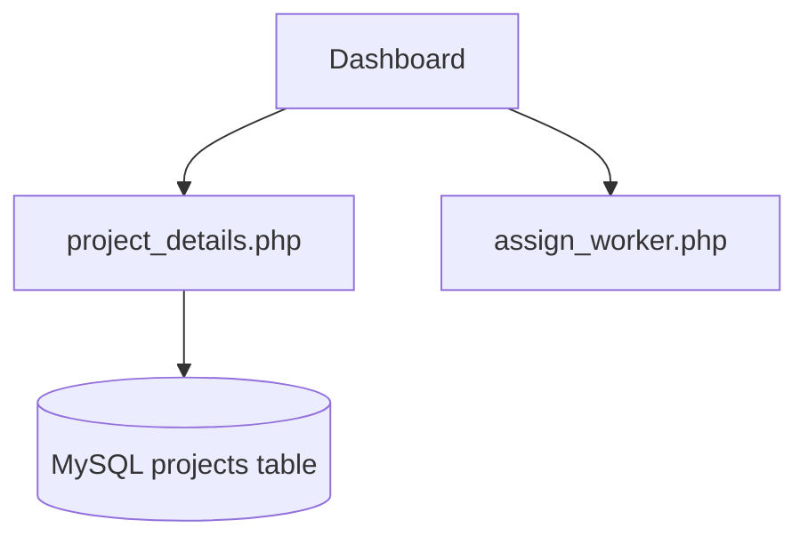

# Dashboard Folder

Contains pages used by site admins/managers to view and manage projects, goods and assignments.

Files
- `assign_worker.php`: Assigns workers to projects; expects `project_id` and `worker_id` inputs.
- `dashboard.php`: Main management dashboard (shows projects, KPIs). Loads optional data from `includes/db.php` and falls back to static demo data when DB is unavailable.
- `goods_invoice.php`: Invoice generation and printing UI for goods delivered.
- `goods_list.php`: Simple list of goods/stock used by invoices.
- `goods_manage.php`: Create/edit goods catalog entries.
- `profile.php`: Manager profile editing.
- `project_details.php`: Detailed view of a project (tasks, workers, status). Pulls project data from DB when available.
- `review_requests.php`: Shows client or internal review requests for projects.

Notes
- Several pages attempt a DB connection via `includes/db.php`. If you are developing locally and don't have the DB, the pages will use fallback data.

Mermaid: high-level flow

