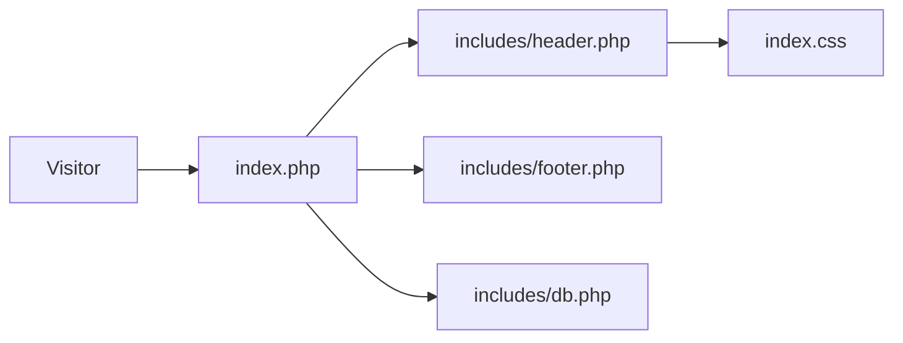

# Public Folder

Public-facing website pages (marketing, contact, products, services). These files are intended to be reachable by unauthenticated visitors.

Files
- `404.php`: Custom 404 page displayed for missing routes.
- `about_us.css`, `index.css`: Stylesheets for the public pages.
- `about_us.js`, `index.js`: Client-side scripts used for interactions and hero/carousel behavior.
- `about_us.php`: About page. Includes header/footer and content sections describing the company.
- `contact_us.php`: Contact form page. Typically posts to a mailer or internal endpoint.
- `index.php`: Site homepage with hero, projects carousel and calls-to-action. Includes `../includes/header.php` to load shared assets.
- `login.php`, `logout.php`: Authentication endpoints for users (login form, logout action).
- `media.php`: Simple media listing used by marketing pages.
- `products.php`, `services.php`: Marketing pages listing products/services.

How pages work
- Each page typically begins by including `../includes/header.php` which loads CSS (via `PROJECT_ROOT` detection) and fonts. Footer is included with `../includes/footer.php`.
- Dynamic data (projects, products) is loaded from `includes/db.php` if available; otherwise pages fall back to static demo data.

Security notes
- Public forms (contact, login) must validate input and protect against CSRF. Currently these are prototype pages and may not include full protections.

Mermaid: page include flow

